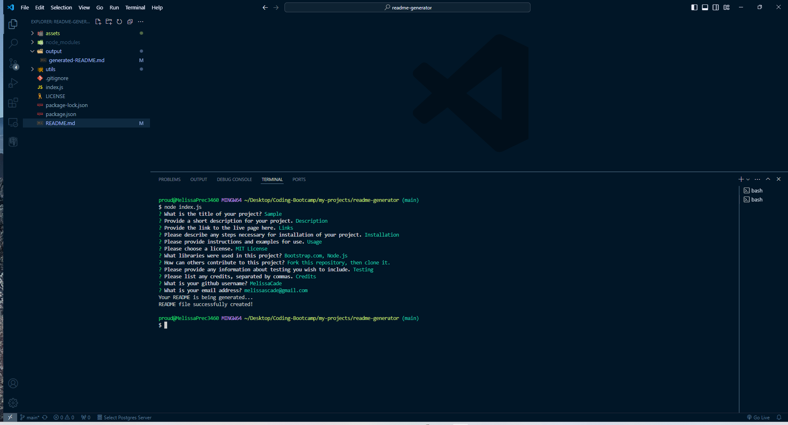

# readme-generator

Generates a README file from user terminal input.

## Table-of-Contents

- [Description](#description)
- [Screenshots](#screenshots)
- [Demonstration](#demonstration)
- [Installation](#installation)
- [Usage](#usage)
- [License](#License)
- [Contributions](#contributions)
- [Links](#links)
- [Credits](#credits)
- [Questions](#questions)

## [Description](#table-of-contents)

This application runs in the terminal to generate a professional README for GitHub repositories. It accepts user input and builds out the architecture of the README file.

## [Screenshots](#table-of-contents)

## [Demonstration](#table-of-contents)

## [Installation](#table-of-contents)

Once you have cloned the repository to your system, run an 'npm i' to install the node modules.

In the index.js file, you can change the default values on line 51, 71, 88, and 94 as required, or enter your own values when you are prompted.

## [Usage](#table-of-contents)

In your terminal, execute the 'node index.js' command.

Answer the prompts appropriately, and the application will produce a readme in the "output" folder.

## [License](#table-of-contents)

The application is covered under the following license:

https://choosealicense.com/licenses/mit/

## [Contributions](#table-of-contents)

Fork this repository, then clone it.

## [Links](#table-of-contents)

This project does not have a deployed page, since it is run in the terminal.

## [Credits](#table-of-contents)

This page uses the materials and resources provided in the University of Denver Coding Bootcamp.

I also used the following websites as reference to figure out how to do everything:

stack overflow - https://stackoverflow.com/  
free code camp - https://www.freecodecamp.org/  
geeks for geeks - https://www.geeksforgeeks.org/  
mdn web docs - https://developer.mozilla.org/en-US/  
w3schools - https://www.w3schools.com/

## [Questions](#table-of-contents)

Please contact me with any questions using the following links:

Github: https://github.com/MelissaCade

Email: melissascade@gmail.com
